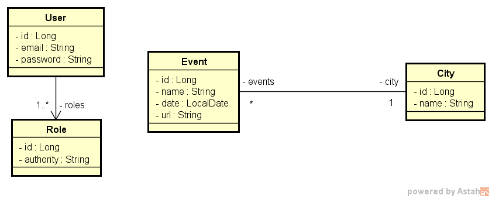

# **Desafio 01 - Curso Java Spring Expert: Módulo 02**
### Enunciado
Deverá criar os endpoints necessários para passar nos testes já escritos préviamente, sem adulterá-los, assim usando a metodologia TDD - Test Driven Development.

### Modelo de Domínio

### Critérios de Correção
- DELETE /cities/{id} deve retornar 404 Not Found quando id não existir;
- DELETE /cities/{id} deve retornar 204 No Content quando id for independente;
- DELETE /cities/{id} deve retornar 400 Bad Request quando id for dependente;
- POST /cities deve inserir recurso; 
- GET /cities deve retornar recursos ordenados por nome;
- PUT /events deve atualizar recurso quando id existir;
- PUT /events deve retornar 404 Not Found quando id não existir.

### Competências avaliadas:
- Desenvolvimento TDD de API Rest com Java e Spring Boot;
- Implementação de cenários de busca, inserção, deleção e atualização;
- Tratamento de exceções em API com respostas HTTP customizadas.
